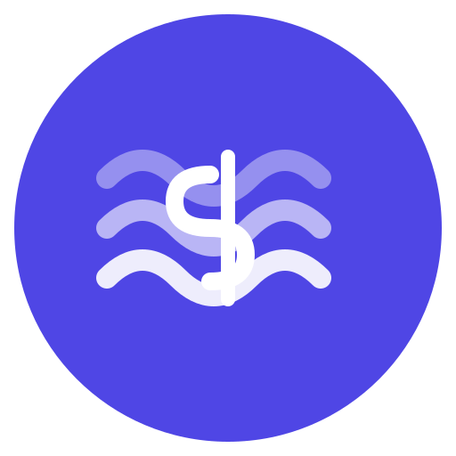

# FixedFlow

<div align="center">



📱 **A simple, offline-first personal finance app for tracking recurring payments**


</div>

## 📖 Overview

FixedFlow is a clean, minimal mobile app designed to help you track and visualize your recurring payments (subscriptions, rent, insurance, etc.). All data is stored locally on your device - no backend, no accounts, no data collection.

### ✨ Features

- **📋 List View**: Manage all your recurring payments in one place
  - Add, edit, and delete payments with a floating action button
  - Quick overview of all subscriptions
  - Sort and organize by category
  - Pull to refresh
  - Empty state with helpful prompts

- **📅 Agenda View**: Calendar-style monthly overview
  - Visualize payments on their due dates
  - Navigate between months with smooth transitions
  - See daily and monthly totals
  - Highlight days with payments
  - Tap days to see payment details
  - Color-coded calendar interface

- **⚙️ Settings & Customization**
  - **🎨 Dark Mode**: Choose between Light, Dark, or System theme
  - **🌍 Multi-Language Support**: English, Dutch, French, and German
  - **📂 Custom Categories**: Create, edit, and delete payment categories
  - **💾 Persistent Preferences**: All settings saved locally

- **💾 Fully Offline**: All data stored locally using AsyncStorage
- **🔒 Privacy First**: No backend, no tracking, no data collection
- **🎨 Modern UI**: Clean, intuitive design with smooth animations
- **📱 Responsive**: Works on phones and tablets
- **♿ Accessible**: Safe area support for notched devices
- **💶 EUR Currency**: Built for European users (easily customizable)

## 🚀 Getting Started

### Prerequisites

- [Node.js](https://nodejs.org/) (v16 or later)
- [npm](https://www.npmjs.com/) or [yarn](https://yarnpkg.com/)
- [Expo CLI](https://docs.expo.dev/get-started/installation/)
- [Expo Go](https://expo.dev/client) app on your mobile device (for testing)

### Installation

1. **Clone the repository**
   ```bash
   git clone https://github.com/tijnndev/fixedflow.git
   cd fixedflow
   ```

2. **Install dependencies**
   ```bash
   npm install
   # or
   yarn install
   ```

3. **Start the development server**
   ```bash
   npm start
   # or
   yarn start
   # or
   npx expo start
   ```

4. **Run on your device**
   - Scan the QR code with Expo Go (Android) or Camera app (iOS)
   - Or press `a` for Android emulator, `i` for iOS simulator

## 📱 Usage

### Adding a Payment

1. Navigate to the **List** tab
2. Tap the **blue floating action button** (+ icon) at the bottom
3. Fill in the details:
   - **Name**: e.g., "Netflix subscription"
   - **Amount**: in EUR (e.g., 15.99)
   - **Frequency**: Monthly, Quarterly, or Yearly
   - **Due Day**: Day of month (1-31)
   - **Start Date**: When this payment started (determines quarterly/yearly schedule)
   - **Category**: Choose from default or custom categories

4. Tap **Save**

### Managing Categories

1. Go to the **Settings** tab
2. Scroll to **Categories** section
3. **Add Custom Category**: 
   - Tap "+ Add Category"
   - Enter category name
   - Tap the checkmark to save
4. **Delete Category**:
   - Tap the trash icon next to any category
   - Default categories (Rent, Subscriptions, etc.) can also be deleted

### Changing Theme

1. Go to **Settings** tab
2. Under **Appearance**, choose:
   - **Light**: Always use light theme
   - **Dark**: Always use dark theme
   - **System**: Follow device settings

### Changing Language

1. Go to **Settings** tab
2. Under **Language**, select:
   - **English** (EN)
   - **Nederlands** (NL)
   - **Français** (FR)
   - **Deutsch** (DE)

### Editing or Deleting

- In the **List** view, tap **Edit** or **Delete** on any payment card
- Confirm deletion when prompted

### Viewing the Calendar

1. Navigate to the **Agenda** tab
2. Use **‹ › buttons** to navigate between months
3. Tap any **highlighted day** to see payments due that day
4. View **monthly total** at the top of the screen
5. Days with payments are highlighted in blue

## 🔄 Recurrence Logic

FixedFlow uses a clear, predictable system for recurring payments:

### Monthly Payments
- Occur every month on the specified due day
- Example: Due day 15 → payment on the 15th of every month

### Quarterly Payments
- Occur every 3 months, based on the start date
- Example: Start date Jan 15 → payments in Jan, Apr, Jul, Oct
- Example: Start date Mar 1 → payments in Mar, Jun, Sep, Dec

### Yearly Payments
- Occur once per year in the same month as the start date
- Example: Start date Feb 15 → payment every year on Feb 15

### Edge Cases
- If due day exceeds days in month (e.g., day 31 in February), the payment is scheduled for the last day of that month

## 🏗️ Project Structure

```
fixedflow/
├── App.tsx                          # Main app component with navigation setup
├── src/
│   ├── components/                  # Reusable UI components
│   │   ├── EmptyState.tsx          # Empty state placeholder with SVG icons
│   │   ├── PaymentCard.tsx         # Payment item display with i18n
│   │   └── PaymentFormModal.tsx    # Add/edit payment form with validation
│   │
│   ├── screens/                     # Main screens with safe area support
│   │   ├── ListScreen.tsx          # List view with floating action button
│   │   ├── AgendaScreen.tsx        # Calendar view with month navigation
│   │   └── SettingsScreen.tsx      # Settings with theme, language, categories
│   │
│   ├── services/                    # Business logic
│   │   ├── storage.ts              # AsyncStorage operations for payments
│   │   └── categories.ts           # Category management service
│   │
│   ├── theme/                       # Theme management
│   │   └── ThemeContext.tsx        # Dark/light/system theme with persistence
│   │
│   ├── i18n/                        # Internationalization
│   │   ├── index.tsx               # Language provider and context
│   │   ├── en.ts                   # English translations
│   │   ├── nl.ts                   # Dutch translations
│   │   ├── fr.ts                   # French translations
│   │   └── de.ts                   # German translations
│   │
│   ├── types/                       # TypeScript definitions
│   │   └── payment.ts              # Data models and interfaces
│   │
│   └── utils/                       # Helper functions
│       └── recurrence.ts           # Recurrence calculation logic
│
├── assets/                          # App assets
│   ├── icon.png                    # App icon (1024x1024)
│   ├── adaptive-icon.png           # Android adaptive icon
│   ├── splash.png                  # Splash screen
│   ├── favicon.png                 # Web favicon
│   └── *.svg                       # Source SVG files
│
├── scripts/                         # Build and utility scripts
│   └── generate-icons.js           # PNG icon generation from SVG
│
├── package.json
├── app.json                         # Expo configuration
├── tsconfig.json                    # TypeScript configuration
├── README.md                        # This file
├── SETUP.md                         # Quick setup guide
├── CONTRIBUTING.md                  # Contribution guidelines
├── suggestions.md                   # Feature suggestions and roadmap
└── LICENSE
```

## 🛠️ Tech Stack

- **Framework**: [React Native](https://reactnative.dev/) with [Expo](https://expo.dev/) SDK 55
- **Language**: [TypeScript](https://www.typescriptlang.org/) 5.3
- **Navigation**: [React Navigation](https://reactnavigation.org/) v6 with bottom tabs
- **Storage**: [@react-native-async-storage/async-storage](https://github.com/react-native-async-storage/async-storage) v1.21
- **Icons**: [@expo/vector-icons](https://docs.expo.dev/guides/icons/) (Ionicons)
- **Safe Area**: [react-native-safe-area-context](https://github.com/th3rdwave/react-native-safe-area-context) v5.3
- **Screens**: [react-native-screens](https://github.com/software-mansion/react-native-screens) v4.10
- **Build Tools**: [Sharp](https://sharp.pixelplumbing.com/) for icon generation

## 🤝 Contributing

Contributions are welcome! This is an open-source project designed to help people track their finances.

### How to Contribute

1. Fork the repository
2. Create a feature branch (`git checkout -b feature/amazing-feature`)
3. Commit your changes (`git commit -m 'Add amazing feature'`)
4. Push to the branch (`git push origin feature/amazing-feature`)
5. Open a Pull Request

### Development Guidelines

- Follow existing code style and conventions
- Write clear commit messages
- Add comments for complex logic
- Test on both iOS and Android when possible
- Keep the UI simple and accessible

## 🐛 Known Issues & Limitations

- **Currency**: Currently hardcoded to EUR (€) - multi-currency support planned
- **Notifications**: No reminder notifications yet - see [suggestions.md](suggestions.md)
- **Cloud Backup**: No cloud backup feature (data is device-only) - planned feature
- **Export**: No data export functionality yet - coming soon
- **Payment History**: Cannot mark individual payments as paid/skipped - in roadmap
- **Category Deletion**: Minor UI refresh issue on web platform (works on mobile)

See [suggestions.md](suggestions.md) for the full feature roadmap and planned improvements.

## 📄 License

This project is licensed under the MIT License - see the [LICENSE](LICENSE) file for details.

## 🙏 Acknowledgments

- Built with ❤️ using Expo and React Native
- Icons by [@expo/vector-icons](https://icons.expo.fyi/)
- Inspired by the need for simple, privacy-focused financial tools

## 📧 Contact & Support

- **Issues**: [GitHub Issues](https://github.com/tijnndev/fixedflow/issues)
- **Discussions**: [GitHub Discussions](https://github.com/tijnndev/fixedflow/discussions)

---

<div align="center">

**Made with ☕ for people who value simplicity and privacy**

[⭐ Star this repo](https://github.com/tijnndev/fixedflow) if you find it useful!

</div>
